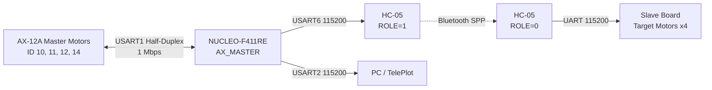

# AX_MASTER

STM32F411RE 마스터 보드에서 AX-12A 모터 4개의 현재 위치를 읽고,
HC-05 Bluetooth 링크를 통해 슬레이브 보드로 전송하는 펌웨어입니다.

마스터 모터는 손으로 움직이는 입력 장치로 사용하므로 부팅 시 Torque를
OFF하고, 각 모터의 현재 위치만 주기적으로 읽습니다.

## 현재 상태

- AX-12A 4개 Ping 및 현재 위치 읽기 확인
- AX-12 버스 1 Mbps 통신 확인
- Master 1~4 Torque OFF 초기화
- USART2 TelePlot 위치 그래프 출력 확인
- HC-05용 USART6 위치 프레임 송신 구현
- Debug 빌드 확인

## 시스템 구조



## 하드웨어

- NUCLEO-F411RE
- Dynamixel AX-12A 4개
- HC-05 Bluetooth 모듈
- AX-12용 외부 9~12V 전원
- AX-12 Half-Duplex DATA 인터페이스

### AX-12 배선

| AX-12 핀 | 기능 | 연결 |
|---:|---|---|
| 1 | GND | 외부 전원 GND와 Nucleo GND |
| 2 | VDD | 외부 9~12V |
| 3 | DATA | PA9 / Arduino D8 |

주의사항:

- AX-12 전원을 Nucleo 5V 핀에서 공급하지 않습니다.
- AX-12 전원 GND와 Nucleo GND를 반드시 공통으로 연결합니다.
- 커넥터 방향과 핀 번호를 확인한 후 전원을 연결합니다.
- 모터 전원과 DATA 배선을 변경할 때는 먼저 전원을 끕니다.

### HC-05 배선

| NUCLEO-F411RE | HC-05 |
|---|---|
| PC6 / USART6_TX | RXD |
| PC7 / USART6_RX | TXD |
| GND | GND |
| 5V | VCC |

일반적인 레귤레이터 내장 HC-05 브레이크아웃 기준입니다. 맨몸 모듈은
전원 사양을 별도로 확인해야 합니다.

## UART 설정

| 인터페이스 | 핀 | Baud rate | 용도 |
|---|---|---:|---|
| USART1 | PA9 / D8 | 1,000,000 | AX-12A Half-Duplex |
| USART2 | PA2 / PA3 | 115,200 | 콘솔 및 TelePlot |
| USART6 | PC6 / PC7 | 115,200 | HC-05 데이터 링크 |

UART 공통 설정은 8 data bits, no parity, 1 stop bit입니다.

## 마스터 모터 매핑

| 논리 모터 | AX-12 ID | 전송 순서 |
|---|---:|---:|
| Master 1 | 10 | 1 |
| Master 2 | 11 | 2 |
| Master 3 | 12 | 3 |
| Master 4 | 14 | 4 |

ID 설정은 `Core/Inc/ax12_config.h`에서 관리합니다.

```c
#define AX12_MASTER_1_ID  10U
#define AX12_MASTER_2_ID  11U
#define AX12_MASTER_3_ID  12U
#define AX12_MASTER_4_ID  14U
```

## 동작 흐름

1. USART1을 1 Mbps Half-Duplex로 초기화합니다.
2. ID 10, 11, 12, 14를 순서대로 Ping합니다.
3. 마스터 모터 4개의 Torque를 OFF합니다.
4. 각 모터의 Present Position을 100Hz로 읽습니다.
5. 모터 ID와 위치값으로 18바이트 프레임을 생성합니다.
6. USART6을 통해 HC-05로 프레임을 전송합니다.
7. USART2에는 TelePlot용 현재 위치를 10Hz로 출력합니다.

## Bluetooth 프레임

위치 프레임은 총 18바이트입니다.

```text
Byte  0      A5             Header 1
Byte  1      5A             Header 2
Byte  2      01             Message type
Byte  3      SEQ            Sequence number
Byte  4      04             Motor count
Byte  5      0A             Master 1 ID
Byte  6~7    POS_L POS_H    Master 1 position
Byte  8      0B             Master 2 ID
Byte  9~10   POS_L POS_H    Master 2 position
Byte 11      0C             Master 3 ID
Byte 12~13   POS_L POS_H    Master 3 position
Byte 14      0E             Master 4 ID
Byte 15~16   POS_L POS_H    Master 4 position
Byte 17      CHECKSUM       XOR checksum
```

위치값은 Little Endian 16비트입니다.

```c
position = pos_l | (pos_h << 8);
```

체크섬은 Message Type(Byte 2)부터 마지막 위치 바이트(Byte 16)까지
모든 바이트를 XOR한 값입니다. 모터 ID가 프레임에 포함되므로 슬레이브는
수신 순서에 의존하지 않고 ID 기준으로 목표 모터를 매핑할 수 있습니다.

## HC-05 설정

HC-05 두 개를 사용할 경우 마스터 보드 모듈은 `ROLE=1`, 슬레이브 보드
모듈은 `ROLE=0`으로 설정합니다.

AT 모드는 일반적으로 KEY를 High로 한 상태에서 전원을 넣고 38400 baud로
접속합니다.

슬레이브 HC-05:

```text
AT
AT+ORGL
AT+ROLE=0
AT+UART=115200,0,0
AT+NAME=AX12_SLAVE
AT+ADDR?
```

마스터 HC-05:

```text
AT
AT+ORGL
AT+ROLE=1
AT+CMODE=0
AT+BIND=<SLAVE_ADDRESS>
AT+UART=115200,0,0
```

HC-05 복제품과 펌웨어 버전에 따라 일부 AT 명령 형식이 다를 수 있습니다.

## TelePlot

USART2는 100ms마다 다음 형식으로 위치값을 출력합니다.

```text
>master_1_pos:512
>master_2_pos:512
>master_3_pos:512
>master_4_pos:512
```

TelePlot 설정:

```text
Port: ST-LINK Virtual COM Port
Baud rate: 115200
Data bits: 8
Parity: None
Stop bits: 1
```

`master_1_pos`부터 `master_4_pos`까지 각각 그래프 영역으로 드래그하면
네 모터의 현재 위치를 독립적으로 확인할 수 있습니다.

## 콘솔 명령

### 상태 확인

```text
status
```

각 마스터 모터의 ID, 현재 위치, Torque 상태를 출력합니다.

### 모터 버스를 1 Mbps로 변환

```text
bus1m
```

`bus1m`은 다음 순서로 동작합니다.

1. ID 10, 11, 12, 14를 115200 baud에서 탐색합니다.
2. 응답한 모터의 Baud Rate EEPROM 값을 1 Mbps로 변경합니다.
3. USART1을 1 Mbps로 변경합니다.
4. 네 모터를 다시 Ping하여 검증합니다.

EEPROM을 변경하는 동안 모터 전원을 끄면 안 됩니다.

## 빌드

### STM32CubeIDE

1. `AX_MASTER.ioc`를 열어 핀 및 UART 설정을 확인합니다.
2. 프로젝트를 Build합니다.
3. ST-LINK로 `AX_MASTER.elf`를 보드에 다운로드합니다.
4. 모터 전원을 켠 후 Nucleo RESET 버튼을 누릅니다.

### CMake

Arm GNU Toolchain과 CMake, Ninja가 설치된 환경에서 실행합니다.

```bash
cmake --preset Debug
cmake --build --preset Debug
```

빌드 결과:

```text
build/Debug/AX_MASTER.elf
```

## 정상 부팅 로그

```text
AX12 init ok: master 4 motors ready (torque off)
AX12 init success
```

특정 모터가 응답하지 않으면 다음처럼 표시됩니다.

```text
AX12 init: ping failed (ID=10)
AX12 init failed
```

## 문제 해결

### 모든 모터가 Ping에 실패하는 경우

- AX-12 외부 전원이 켜져 있는지 확인합니다.
- AX-12 GND와 Nucleo GND가 공통인지 확인합니다.
- DATA가 PA9 / D8에 연결됐는지 확인합니다.
- MCU와 모터 Baud rate가 모두 1 Mbps인지 확인합니다.
- 모터 ID가 10, 11, 12, 14인지 확인합니다.

### TelePlot 출력은 보이지만 명령이 실행되지 않는 경우

- TelePlot 송신 줄 끝을 LF 또는 CRLF로 설정합니다.
- 명령을 OS 터미널이 아닌 Serial 입력창으로 전송합니다.
- USART2 RX 인터럽트가 활성화돼 있는지 확인합니다.

### Bluetooth 데이터가 전달되지 않는 경우

- HC-05 두 모듈의 LED 연결 상태를 확인합니다.
- 양쪽 UART가 모두 115200인지 확인합니다.
- 마스터가 슬레이브 주소에 BIND됐는지 확인합니다.
- TX와 RX가 교차 연결됐는지 확인합니다.

## 디렉터리 구조

```text
AX_MASTER/
├── AX_MASTER.ioc
├── Core/
│   ├── Inc/
│   │   ├── ax12.h
│   │   ├── ax12_app.h
│   │   └── ax12_config.h
│   └── Src/
│       ├── ax12.c
│       ├── ax12_app.c
│       └── ax12_config.c
├── Drivers/
├── cmake/
├── CMakeLists.txt
├── CMakePresets.json
└── README.md
```

## 다음 작업

- AX_SLAVE 프로젝트 생성
- Slave 1~4 모터 ID 매핑
- USART6 수신 인터럽트 또는 DMA 구현
- 18바이트 위치 프레임 파싱
- XOR 체크섬과 Sequence 검증
- 방향 반전 및 중심 Offset 설정
- Bluetooth 수신 Timeout 안전 동작
- 수신 위치를 슬레이브 AX-12 Goal Position으로 적용
